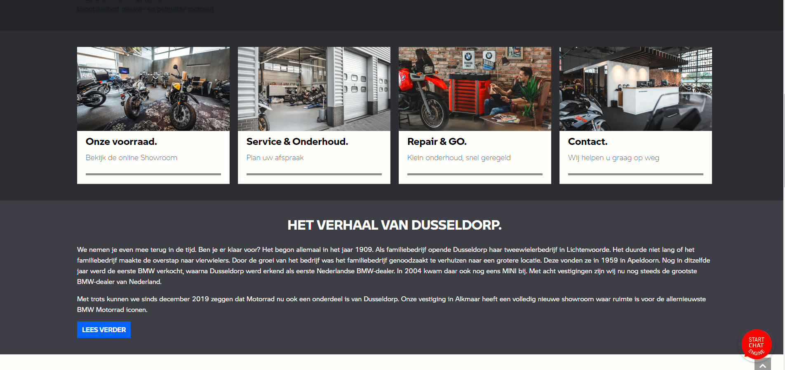
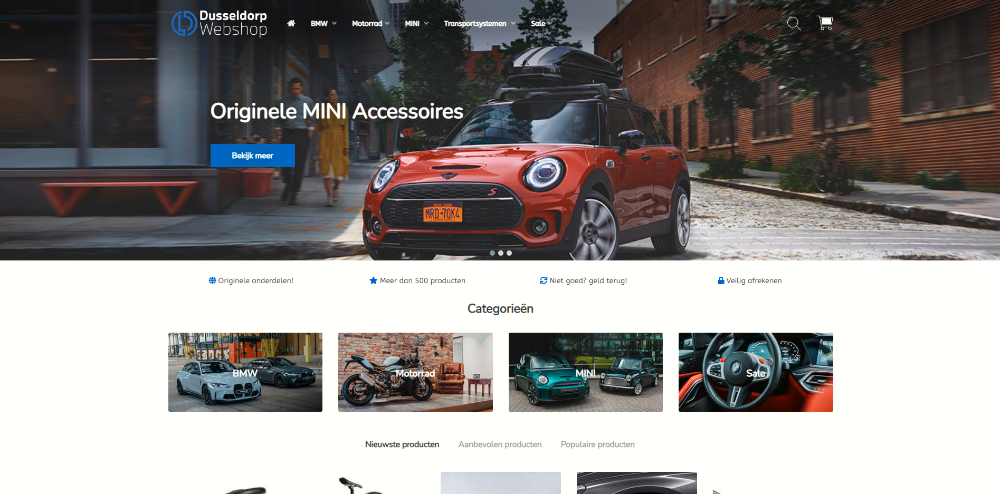
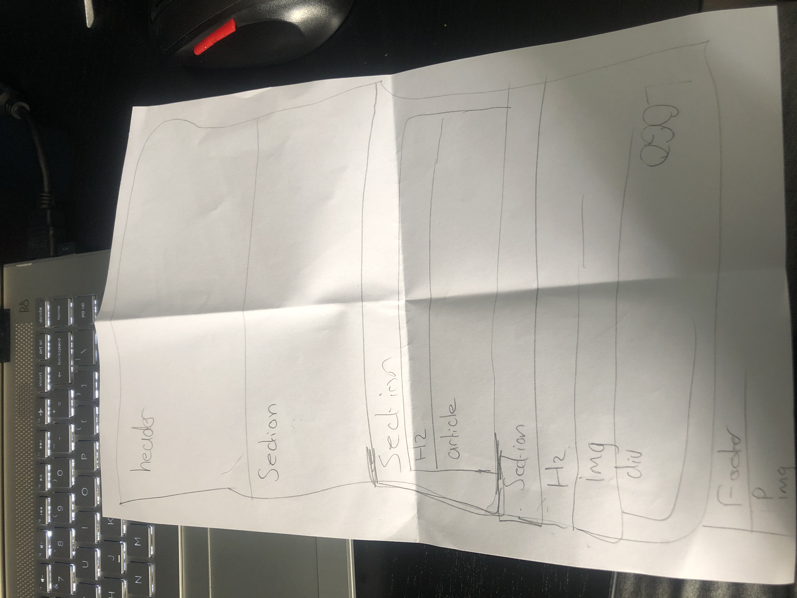
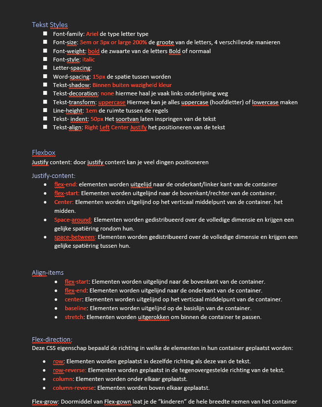

# Procesverslag
Markdown is een simpele manier om HTML te schrijven.  
Markdown cheat cheet: [Hulp bij het schrijven van Markdown](https://github.com/adam-p/markdown-here/wiki/Markdown-Cheatsheet).

Nb. De standaardstructuur en de spartaanse opmaak van de README.md zijn helemaal prima. Het gaat om de inhoud van je procesverslag. Besteedt de tijd voor pracht en praal aan je website.

Nb. Door *open* toe te voegen aan een *details* element kun je deze standaard open zetten. Fijn om dat steeds voor de relevante stuk(ken) te doen.

## Jij

uitwerken voor kick-off werkgroep

### Auteur:
David Dankwah

#### Je startniveau:
rood (denk ik)

#### Je focus:
Mijn focus wordt surface plane
 

## Je website

uitwerken voor kick-off werkgroep

### Je opdracht:
https://dusseldorpmotorrad.nl/ dit de website die ik ga namaken. Ken zelf geen leuke website of iets maar was toevallig al op deze website bezig
 en het viel me op dat het leuke hover animaties had dus besloot om hier voor te kiezen. Zelf zou ik wel een paar andere css anomaties erbij toevoegen om het misschen wat levender te maken

#### Screenshot(s) van de eerste pagina (small screen): 
hier de naam van de pagina  

#### Screenshot(s) van de tweede pagina (small screen):
hier de naam van de pagina  

 

## Breakdownschets (week 1)

Breakdownschets van de desbetrefende site

### de hele pagina: 
 <h2>BMW Motorrad</h2>
 
Tijdens de werkgroep moesten we onze site gaat ontleden en het in semantische html gaan schetsen. ik had de hoofdpagina gedaan van mijn site

 
Hier ziet u wat voor onderdelen ik in mijn site heb. bij sommige onderdelen ben ik niet heel diep in gegaan en heb ik het globaal gelaten. Bij andere weer wel.

### dynamisch deel (bijv menu): 
 
Bij mijn tweede schets ben ik heel diep op mijn header in gegaan, de navigatie, de titels afbeeldingen ect.

 <h2>Flex Flex Flex!</h2>
 
In de tweede werk groep gingen we aan de slag met flexboxen, ik had daar vorig jaar best wel wat moeite mee dus ik maakte veel aantekeningen zodat ik die kon onthouden en terug lezen uit de stof en de filmpjes. Deze heb ik dan ook weer gebruikt bij het maken van de opdrachten en het ging veel beter dan ik dacht.

  
  

## Voortgang 1 (week 2)

uitwerken voor 1e voortgang

### Stand van zaken
oIn week 2 ging ik aan de slag met een groten deel van mijn css. In deze week hadden we les gekregen over het positioneren van elementen. Dit kwam goed voor mij uit want. er zaten een paar leuke tussen die ik in mijn site wilde toepassen. Zoals "Mount Doom in Tongario National Park" heb ook gebruik gemaakt van z-index om bepaalde elementen over elkaar laten lappen. JS had ik ook toevoegd, dit was wel een klus, had er namelijk best wel moeite mee dus had mijn docent en student assistent BO ingeschakeld voor hulp. Waar ik namelijk tegen aan liep was het tevorschijn halen en laten verdwijnen van mijn menu kaart.
 
 

### Agenda voor meeting
samen met je groepje opstellen

| student 1      | student 2          | student 3    | student 4            |
| ---            | ---                | ---          | ---                  |
| dit bespreken  | en dit             | en ik dit    | Het laten verdwijnen |
| en dat ook nog | dit als er tijd is | nog een punt | en te voorschijn     |
| ...            | ...                | ...          | van de dropdown      |

### Verslag van meeting
hier na afloop snel de uitkomsten van de meeting vastleggen

- op een logsiche wijze het icon van mijn menu laten verdwijnen en voorschijn laten halen (media)
- css animaties er beter uit laten zien shoutout to Bo!
- Het menu te voorschijn kunnen halen.

## Voortgang 2 (week 3)

uitwerken voor 2e voortgang

### Stand van zaken
in week 3 ben ik begonnen aan mijn andere website. Hier heb ik een een paar andere dingen toegevoegd aan de website die niet bij het orginele site waren. Omdat ik 
 daar op wilde oefenen. Zoals een formulier. Die goed weergeven en met de juiste code ook. Ik had zelf een beetje moeite met het positioneren van mijn input velden. dus daar had ik hulp bij gevraagd.
  
   
 Ook had ik problemen met mijn footer. het was totaal verandert na dat ik mijn classes eruit heb gehaald en heb nog steeds problemen mee om het weer goed te krijgen en om de "onbelangrijke" inhoud erin dicht te klappen. Het heeft heel veel wit ruimte ertussen en het is niet op de juiste manier uitgelijnd.
 
 
 

### Agenda voor meeting
samen met je groepje opstellen

| student 1      | student 2          | student 3    | student 4        |
| ---            | ---                | ---          | ---              |
| dit bespreken  | en dit             | en ik dit    | het positioneren |
| en dat ook nog | dit als er tijd is | nog een punt | van de input     |
| ...            | ...                | ...          | velden           |

### Verslag van meeting
hier na afloop snel de uitkomsten van de meeting vastleggen

- Doormiddel van wat we hadden geleerd in de les (GRID) heb ik mijn formulier precies kunnen stijlen als hoe ik het wilde.
- helaas nog niet uitgekomen met de footer maar dat komt wel!
- nog een punt
- ...

## Toegankelijkheidstest (week 4)

uitwerken na test in 8e voortgang

### Bevindingen
Lijst met je bevindingen die in de test naar voren kwamen:

#### Titel eerste bevinding
Hier korte omschrijving (met indien nodig een afbeelding)

Hier een omschrijving van hoe het opgelost kan worden (met indien nodig een afbeelding)

#### Titel tweede bevinding. 
Hier korte omschrijving (met indien nodig een afbeelding)

Hier een omschrijving van hoe het opgelost kan worden (met indien nodig een afbeelding)

#### Titel volgende bevinding. 
Hier korte omschrijving (met indien nodig een afbeelding)

Hier een omschrijving van hoe het opgelost kan worden (met indien nodig een afbeelding)

#### Titel nog een bevinding. 
Hier korte omschrijving (met indien nodig een afbeelding)

Hier een omschrijving van hoe het opgelost kan worden (met indien nodig een afbeelding)

## Voortgang 3 (week 4)

uitwerken voor 3e voortgang

### Stand van zaken
hier dit ging goed & dit was lastig (neem ook screenshots op van delen van je website en code)

### Agenda voor meeting
samen met je groepje opstellen

| student 1      | student 2          | student 3    | student 4        |
| ---            | ---                | ---          | ---              |
| dit bespreken  | en dit             | en ik dit    | en dan ik dat    |
| en dat ook nog | dit als er tijd is | nog een punt | dit wil ik zeker |
| ...            | ...                | ...          | ...              |

### Verslag van meeting
hier na afloop snel de uitkomsten van de meeting vastleggen

- punt 1
- punt 2
- nog een punt
- ...

## Eindgesprek (week 5)

uitwerken voor eindgesprek

### Stand van zaken
hier dit ging goed & dit was lastig (neem ook screenshots op van delen van je website en code)

### Screenshot(s)

hier screenshot(s) van je eindresultaat

## Bronnenlijst

continu bijhouden terwijl je werkt

Nb. Wees specifiek ('css-tricks' als bron is bijv. niet specifiek genoeg).

1. bron 1
2. bron 2
3. ...

