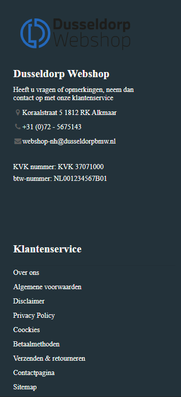

# Procesverslag
Markdown is een simpele manier om HTML te schrijven.  
Markdown cheat cheet: [Hulp bij het schrijven van Markdown](https://github.com/adam-p/markdown-here/wiki/Markdown-Cheatsheet).

Nb. De standaardstructuur en de spartaanse opmaak van de README.md zijn helemaal prima. Het gaat om de inhoud van je procesverslag. Besteedt de tijd voor pracht en praal aan je website.

Nb. Door *open* toe te voegen aan een *details* element kun je deze standaard open zetten. Fijn om dat steeds voor de relevante stuk(ken) te doen.

## Jij

uitwerken voor kick-off werkgroep

### Auteur:
David Dankwah

#### Mijn startniveau:
rood (denk ik)

#### Mijn focus:
Mijn focus wordt surface plane
 

## Mijn website
davidsd29.github.io/blokweb/bmw

uitwerken voor kick-off werkgroep

### De opdracht:
https://dusseldorpmotorrad.nl/ dit de website die ik ga namaken. Ken zelf geen leuke website of iets maar was toevallig al op deze website bezig
 en het viel me op dat het leuke hover animaties had dus besloot om hier voor te kiezen. Zelf zou ik wel een paar andere css anomaties erbij toevoegen om het misschen wat levender te maken

#### Screenshot(s) van de eerste pagina (small screen): 
hier de naam van de pagina  

#### Screenshot(s) van de tweede pagina (small screen):
hier de naam van de pagina  

 

## Breakdownschets (week 1)

Breakdownschets van de desbetrefende site

 <h2>BMW Motorrad</h2>
 
Tijdens de werkgroep moesten we onze site gaat ontleden en het in semantische html gaan schetsen. ik had de hoofdpagina gedaan van mijn site

 
Hier ziet u wat voor onderdelen ik in mijn site heb. bij sommige onderdelen ben ik niet heel diep in gegaan en heb ik het globaal gelaten. Bij andere weer wel.

### dynamisch deel (bijv menu): 
 
Bij mijn tweede schets ben ik heel diep op mijn header in gegaan, de navigatie, de titels afbeeldingen ect.

 <h2>Flex Flex Flex!</h2>
 
In de tweede werk groep gingen we aan de slag met flexboxen, ik had daar vorig jaar best wel wat moeite mee dus ik maakte veel aantekeningen zodat ik die kon onthouden en terug lezen uit de stof en de filmpjes. Deze heb ik dan ook weer gebruikt bij het maken van de opdrachten en het ging veel beter dan ik dacht.

  
  

## Voortgang 1 (week 2)

uitwerken voor 1e voortgang

### Stand van zaken
In week 2 ging ik aan de slag met een groten deel van mijn css. In deze week hadden we les gekregen over het positioneren van elementen. Dit kwam goed voor mij uit want. er zaten een paar leuke tussen die ik in mijn site wilde toepassen. Zoals "Mount Doom in Tongario National Park" heb ook gebruik gemaakt van z-index om bepaalde elementen over elkaar laten lappen. JS had ik ook toevoegd, dit was wel een klus, had er namelijk best wel moeite mee dus had mijn docent en student assistent BO ingeschakeld voor hulp. Waar ik namelijk tegen aan liep was het tevorschijn halen en laten verdwijnen van mijn menu kaart.
 
 

### Agenda voor meeting
samen met je groepje opstellen

| student 1          | student 2    | student 3            |
| CSS                | backdrop-    | ---                  |
| Background images  | filter       | Het laten verdwijnen |
| dit als er tijd is |              | en te voorschijn     |
|                    |              | van de dropdown      |

### Verslag van meeting
hier na afloop snel de uitkomsten van de meeting vastleggen

- op een logsiche wijze het icon van mijn menu laten verdwijnen en voorschijn laten halen (media)
- css animaties er beter uit laten zien shoutout to Bo!
- Het menu te voorschijn kunnen halen.

## Voortgang 2 (week 3)

uitwerken voor 2e voortgang

### Stand van zaken
in week 3 ben ik begonnen aan mijn andere website. Hier heb ik een een paar andere dingen toegevoegd aan de website die niet bij het orginele site waren. Omdat ik 
 daar op wilde oefenen. Zoals een formulier. Die goed weergeven en met de juiste code ook. Ik had zelf een beetje moeite met het positioneren van mijn input velden. dus daar had ik hulp bij gevraagd.
  
   
 Ook had ik problemen met mijn footer. het was totaal verandert na dat ik mijn classes eruit heb gehaald en heb nog steeds problemen mee om het weer goed te krijgen en om de "onbelangrijke" inhoud erin dicht te klappen. Het heeft heel veel wit ruimte ertussen en het is niet op de juiste manier uitgelijnd.
 
 
 

### Agenda voor meeting
samen met je groepje opstellen

| student 1      | student 2          | student 3    | student 4        |
| ---            | ---                | ---          | ---              |
| dit bespreken  | en dit             | en ik dit    | het positioneren |
| en dat ook nog | dit als er tijd is | nog een punt | van de input     |
| ...            | ...                | ...          | velden           |

### Verslag van meeting
hier na afloop snel de uitkomsten van de meeting vastleggen

- Doormiddel van wat we hadden geleerd in de les (GRID) heb ik mijn formulier precies kunnen stijlen als hoe ik het wilde.
- helaas nog niet uitgekomen met de footer maar dat komt wel!
- nog een punt
- ...

## Toegankelijkheidstest (week 4)

uitwerken na test in 8e voortgang

### Bevindingen
Deze week zijn we aan de slag geweest met de toegangelijkheid van onze website. Is het ook bruikbaar voor mensen met een beperking? Of mensen die slechtziend zijn?
 Dit hebben we getest doormiddel van speciale brillen te dragen die je zicht belemeren, Mmet 2 verschillende dingen tegelijkertijd bezig zijn, een apparaat die je stroomstoten geeft hierdoor kan je het effect van parkingson na botsen en elastieken om je vingers doen.

#### Titel eerste bevinding
 <h2>Moteriek test met parkinson test apparaat</h2>
 Niet iedereen weet hoe het leven is met parkinson maar het het is wel iets wat je als ontwerper zijnde in je achterhoofd moet houden. Zo kan een ontwerper zijn site zo gebruikers vriendelijk maken voor meerdere type gebruikers. Doormiddel van een schok apparaat hebben we et effect van parkinson kunnen na botsen. Ik heb het apparaat op mijn arm gezet en ben door mijn site heen gegaan.
 

Hier een omschrijving van hoe het opgelost kan worden (met indien nodig een afbeelding)
Doormiddel van de test ben ik er achter gekomen dat het gebruik van een muis heel lastig is en dat zo"n gebruiker eerder door de site heen gaat tabben dan het klikken met de muis. Hier merkte ik dat niet alle elementen werden gepakt met de tab en dat het soms verdween of niet duidelijk genoeg was wat nou gefocused was. 
 
 <h4>Oplossingen</h4>
 <ol>
  <li>In mijn navigatie heb ik alles een link gegeven zodat het visueel zichtbaar werd als je er door heen ging tabben. </li>
  <li>Ik had 2 keer een menu in me code waardoor als je door me site ging tabben de focus verdween omdat het naar de andere menu ging die niet zichtbaar was. Dit heb ik   aangepast doormiddel van het tweede menu eruit te halen en de orginele menu te laten veranderen als het op een kleinere device werd gedisplayd.</li>
  
 </ol>

 <h2>Onverwachte afleiding tijdens het bezoeken van de site</h2>
Het komt iedereen wel eens voor dat je bezig bent op het internet en je wordt opeens gebeld of er komt een mug in je kamer die je wilt door maken. Dan verdwijnt de focus en raak je afgeleid door wat er gebeurt. Maar weet je dan nog waar je bent gebleven? Wat je nog moet invullen in een formulier? Dat is wat ik ben gaan testen doormiddel van een balon hoog te houden en een formulier in te vullen.
  

Hier een omschrijving van hoe het opgelost kan worden (met indien nodig een afbeelding)
Dit verliep best goed want ik had gier al rekening mee gehouden doormiddel van altijd de label te koppelen aan de input veld en ook boven het iput veld te plaatsen zodat de gebruiker altijd weet wat erin moet. Als extra's heb ik nog een placeholder erbij toegevoed als extra steun.

 <h2>Slechte motoriek</h2>
Niet iedereen heeft alle vingers precies zoals ze "moeten" zijn, ook een groep waar je als ontwerper rekening mee moet houden. Dit heb ik ook getest doormiddel van elastieken om mijn wijs- en middelvingers te doen en mijn website te bezoeken. 

 
 
#### bevindingen. 
Je merkt dat je veel meer je andere vingers gaat gebruiken om het te compenseren. Dat betekent ook dat het fijner is als knoppen die in de buurt van die vinger liggen vaker worden gebruikt. zoals van je linker had de tab want die is bij je pink, of van je rechter hand de enter knop. Doormiddel van een goede focus bij de elementen dan moet het goed te doen zijn.

## Voortgang 3 (week 4)

uitwerken voor 3e voortgang

### Stand van zaken
hier dit ging goed & dit was lastig (neem ook screenshots op van delen van je website en code)

### Agenda voor meeting
samen met je groepje opstellen

| student 1      | student 2          | student 3    | student 4        |
| ---            | ---                | ---          | ---              |
| dit bespreken  | en dit             | en ik dit    | en dan ik dat    |
| en dat ook nog | dit als er tijd is | nog een punt | dit wil ik zeker |
| ...            | ...                | ...          | ...              |

### Verslag van meeting
hier na afloop snel de uitkomsten van de meeting vastleggen

- punt 1
- punt 2
- nog een punt
- ...

## Eindgesprek (week 5)

uitwerken voor eindgesprek

### Stand van zaken
hier dit ging goed & dit was lastig (neem ook screenshots op van delen van je website en code)

### Screenshot(s)

hier screenshot(s) van je eindresultaat

## Bronnenlijst

continu bijhouden terwijl je werkt

Nb. Wees specifiek ('css-tricks' als bron is bijv. niet specifiek genoeg).

1. bron 1
2. bron 2
3. ...

